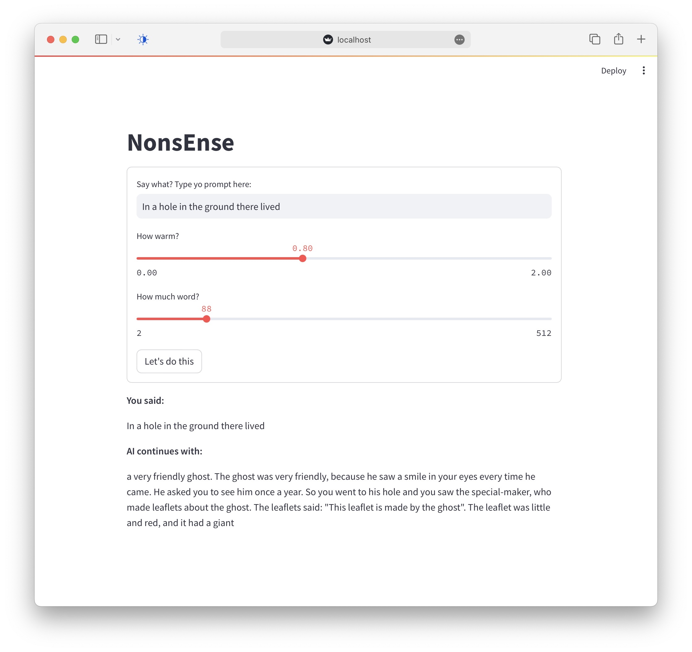

# NonsEnse

Simple local app to explore `temperature` in GPT output.

**No API calls** but need to download models as below.

# Run

1. Install per `requirements.txt`
1. Obtain model files and edit `model_dir` path in `app.py`. See [1]
1. Type `make prev` to view app (locally)

[1] Here, `model_1_1B_4bit` contains `config.json`, `tokenizer.model`,
`weights.safetensors`. You'll need to **download these**

# Determinism?

For temperature > 0, the outputs can vary. You can set a random seed by
changing to `key=True` in the signature for `sample()` in `inference.py`, as
follows:

    def sample(logits, key=True):

# Built with

[apple/corenet](https://github.com/apple/corenet) especially `mlx_examples/open_elm`

[ml-explore/mlx](https://github.com/ml-explore/mlx)

[streamlit.io](https://streamlit.io)
